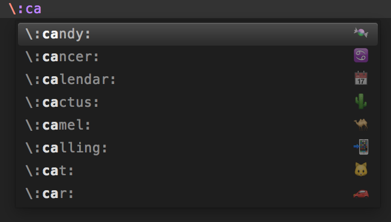

### Julia-Unicode

This is a simple package to insert Unicode characters (both latex and emoji symbols) to Julia as in Julia REPL.
For some reasons, [Julia Completions](https://github.com/jakeconnor/JuliaCompletions) doesn't quite
work for me and [UnicodeMath](https://github.com/mvoidex/UnicodeMath)
keymapping is different from Julia (e.g., `\epsilon` and `\varepsilon`), so I
created this package.
The list of unicodes is generated from
[Julia](https://github.com/JuliaLang/julia/), see [latex_symbols.jl](latex_symbols.jl) and [emoji_symbols.jl](emoji_symbols.jl). 

Check [Julia Docs](http://docs.julialang.org/en/latest/manual/unicode-input/) for the complete list of supported Unicode.

It also provides a command `Unicode Reverse Lookup` (can be found in Command Palette) to lookup the corresponding input of the unicode under the cursor.

#### Insert LaTeX symbol:

Type `\alpha` and hit enter/tab to insert the corresponding unicode `α` to Sublime Text. Similar to other latex symbols.

#### Insert Emoji 🍰:

Type `\:cake:` and hit enter/tab to insert the corresponding unicode 🍰 to Sublime Text.

#### Known issues

It is known that Sublime Text autocompletion pop up window does not show 👍 (`\:+1:`) and powers (e.g., `\^2`), to insert them, they have to be exactly typed and followed by a <kbd>tab</kbd>.
