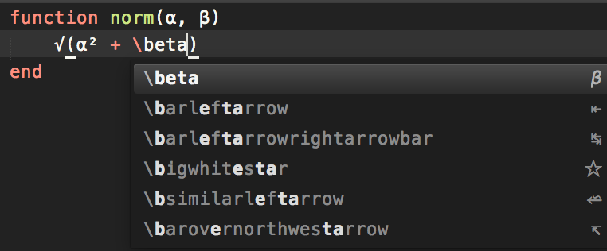

### Julia UTF-8

This is a simple package to insert Unicode characters to Julia as in Julia REPL.
The list of unicodes is copied from [Julia Completion](https://github.com/jakeconnor/JuliaCompletions). For some reasons, Julia Completions doesn't quite work for me, so I created this package. 

#### Usage:

Type `\alpha` and hit enter/tab to insert the corresponding unicode `α` to Sublime Text. Similar to other unicodes.

#### Known issues:

It is known that there is a bug in handling superscriptions and subscrtions, e.g. `\^2`. I have no plan to fix them for now.
