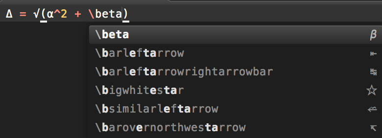
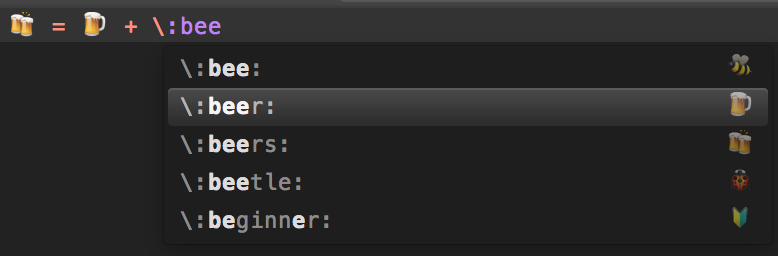
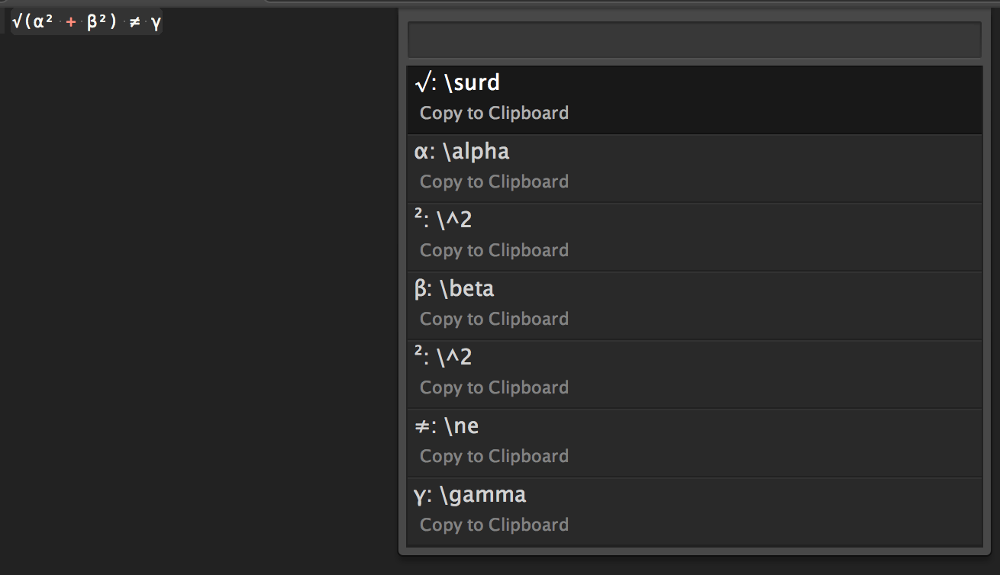

# Julia Unicode

Julia REPL has a very nice way to insert Unicode characters (both latex and emoji symbols). This package brings the same feature to Sublime Text.
There exists similar packages, [Julia Completions](https://github.com/jakeconnor/JuliaCompletions) and [UnicodeMath](https://github.com/mvoidex/UnicodeMath). But they have their own issues and do not support Emojis 😞. 

Julia Unicode is activated automatically for Julia syntax. To enable it for
other syntaxes, check the item `Julia Unicode Enabled` in the Edit menu.
Alternatively, it can be toggled via Command Palette. If you want to enable it for a
specific syntax, edit the specific syntax settings file and add `"julia_unicode" : true`. 

The list of unicodes is generated from
[Julia](https://github.com/JuliaLang/julia/), see [latex_symbols.jl](latex_symbols.jl) and [emoji_symbols.jl](emoji_symbols.jl). 

Check [Julia Docs](http://docs.julialang.org/en/latest/manual/unicode-input/) for the complete list of supported Unicodes.

### Insert LaTeX symbol δ:

Type `\alpha` and hit enter/tab to insert the corresponding unicode `α` to Sublime Text. Similar to other latex symbols.

### Insert Emoji 🍺:

Type `\:beer:` and hit enter/tab to insert the corresponding unicode 🍺 to Sublime Text. 
It is known that Sublime Text autocompletion pop up window does not show 👍 (`\:+1:`) and superscriptions (e.g., `\^2`) correctly, to insert them, they have to be exactly typed and followed by a <kbd>tab</kbd>.

### Lookup and Reverse lookup

It also provides commands `Unicode Lookup` and `Unicode Reverse Lookup` (can be found in Command Palette) to lookup the unicodes or the corresponding input of the unicodes under the cursor or the selection. If no unicode is detected, a input prompt will be shown to ask for a unicode.

